<p align="center"><a href="https://www.******.com" target="_blank" rel="noopener noreferrer"></a></p>

## Entorno

node: v16.13.0

Consultar la relación de versiones entre node-sass y node
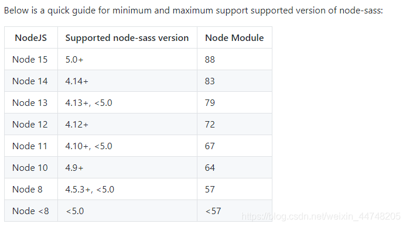

## Introducción

La página se ha desarrollado utilizando exclusivamente los frameworks VUE + VUEX + ElementUI. Las peticiones se realizan con axios, la navegación con vue-router, y se complementa con otras excelentes librerías pequeñas. Se ha descartado por completo HTML y jQuery para construir un blog personalizado y único. Muchas páginas y componentes se migraron de H5 a VUE; aunque el proceso fue bastante desafiante, el resultado es muy satisfactorio.


## Vista previa

[Vista previa](https://zhua-an.github.io/zhua-blog-ui-dome)

## Desarrollo

```
# Clonar el proyecto
git clone https://github.com/zhua-an/zhua-blog-ui-dome.git

# Entrar al proyecto
cd zhua-blog-ui-dome

# Instalar dependencias
npm install --registry=https://registry.npm.taobao.org

# Iniciar el servicio
npm run serve

```
## Características
- Artículos del blog
- Literatura
- Reflexiones
- Recursos
- Mensajes
- Enlaces


## Capturas de pantalla

### Página principal


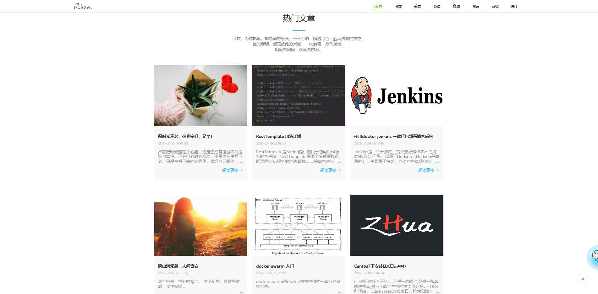

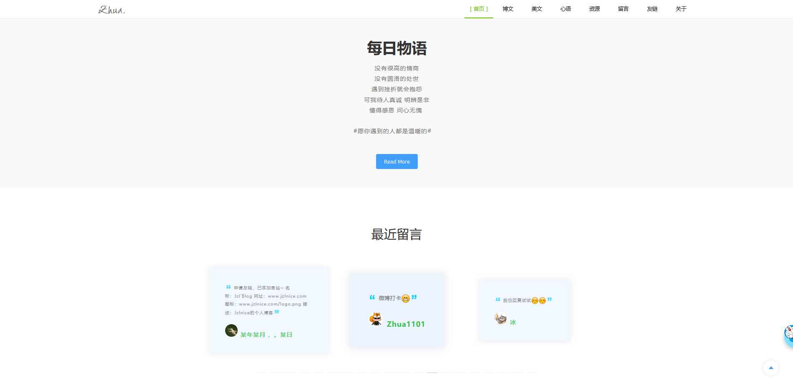

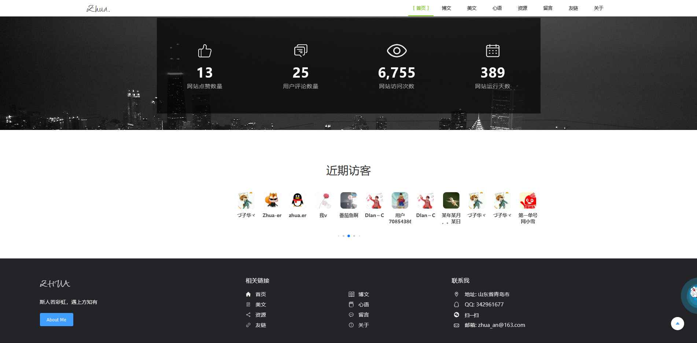

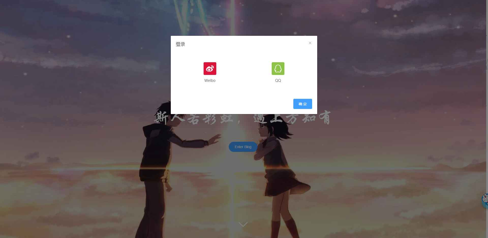

### Artículos del blog

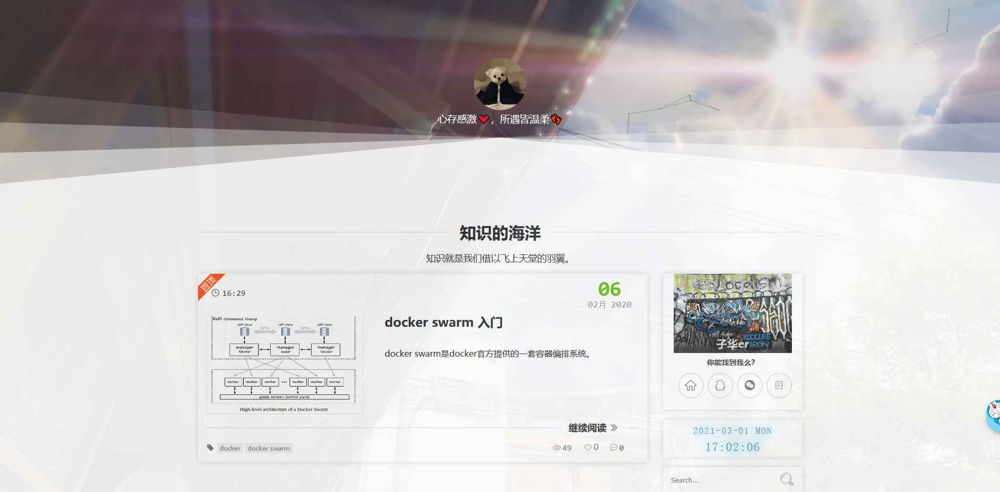

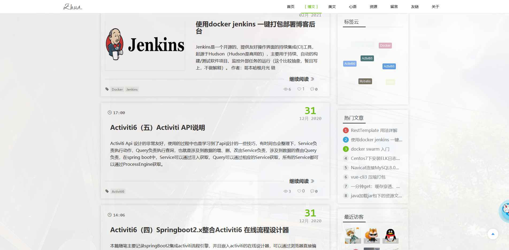

### Literatura

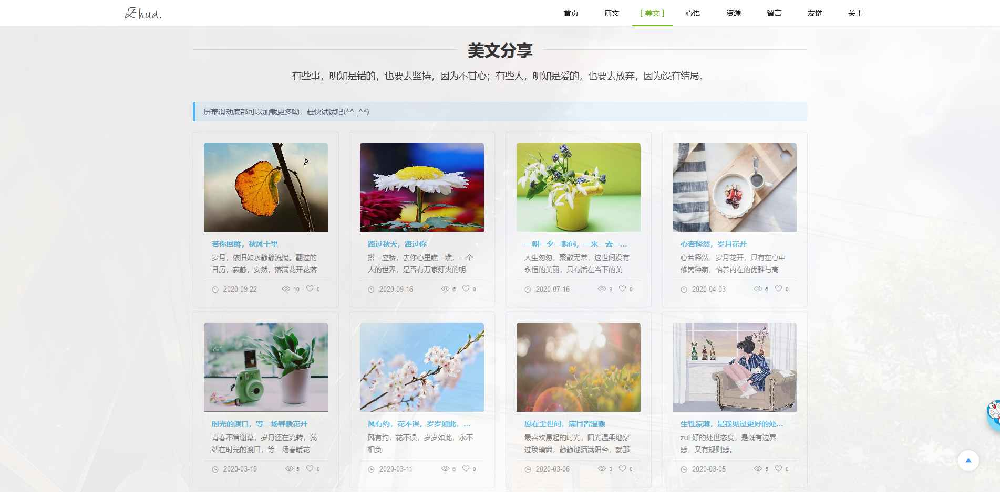

### Reflexiones

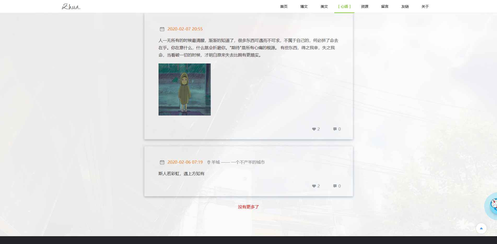

### Recursos

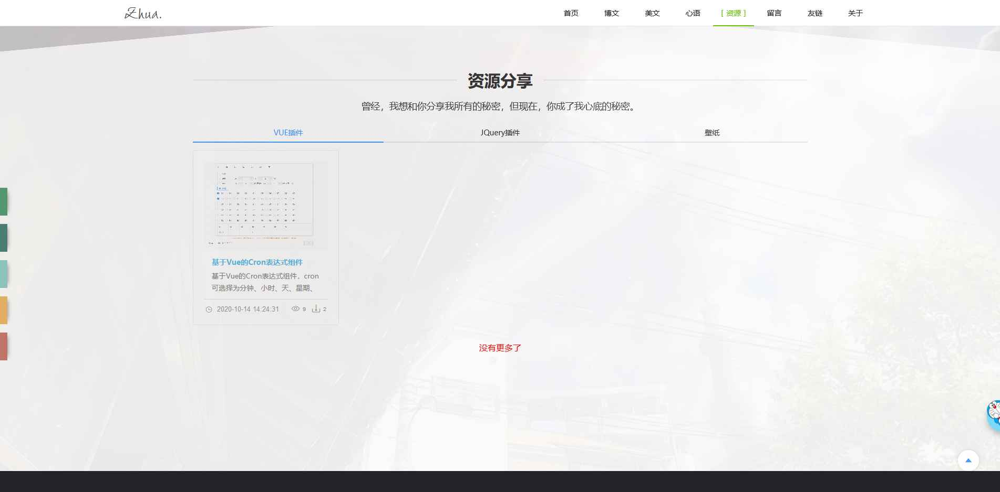

### Cuaderno de mensajes

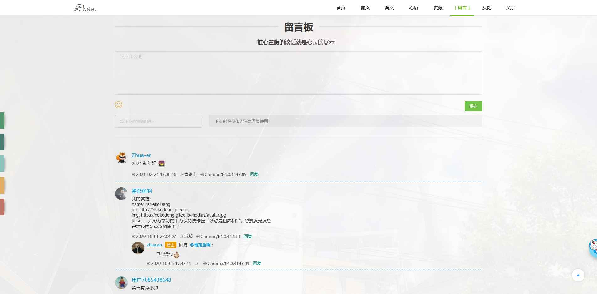

### Enlaces

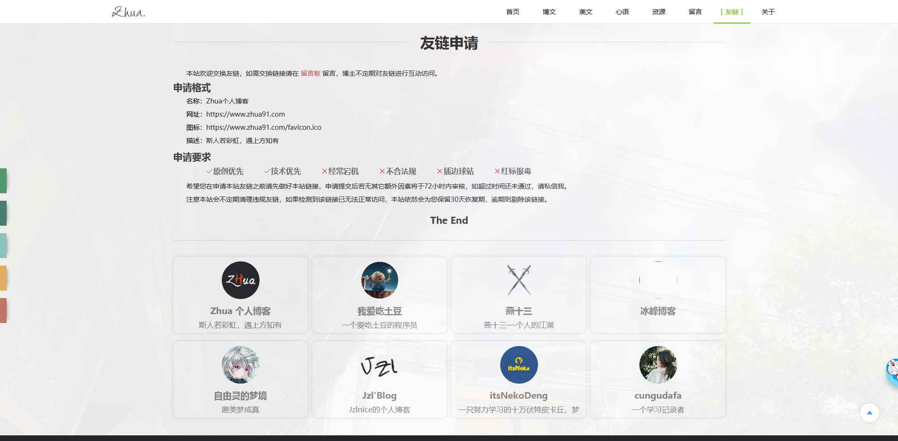

### Acerca de

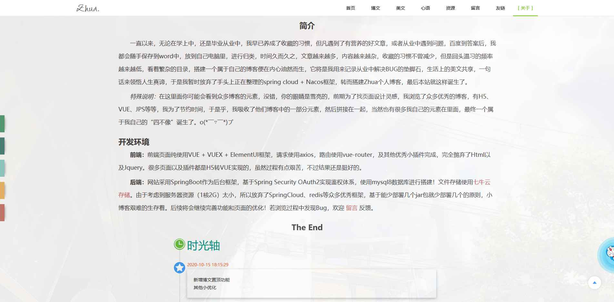

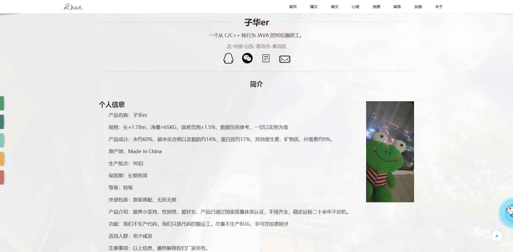


Derechos de autor (c) 2020-presente, Zhua
