<p align="center"><a href="https://www.zhua91.com" target="_blank" rel="noopener noreferrer"></a></p>

## 环境

node: v16.13.0

查看node-sass和node版本对应关系
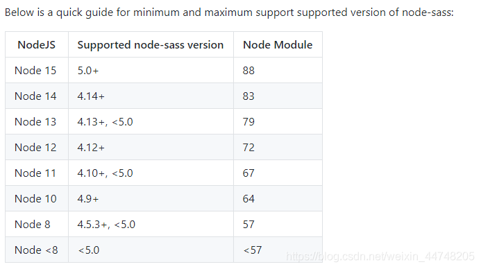

## 介绍

页面纯使用VUE + VUEX + ElementUI框架，请求使用axios，路由使用vue-router，及其他优秀小插件完成，完全抛弃了Html以及Jquery，搭建一套完全属于自己的个性博客。 很多页面以及插件都是H5转VUE实现的，虽然过程有点艰苦，不过结果还是挺好的。


## 预览

[预览](https://www.zhua91.com)

## 开发

```
# 克隆项目
git clone https://github.com/zhua-an/zhua-blog-ui-dome.git

# 进入项目
cd zhua-blog-ui-dome

# 安装依赖
npm install --registry=https://registry.npm.taobao.org

# 启动服务
npm run serve

```
## 功能
- 博文
- 美文
- 心语
- 资源
- 留言
- 友链


## 截图

### 首页
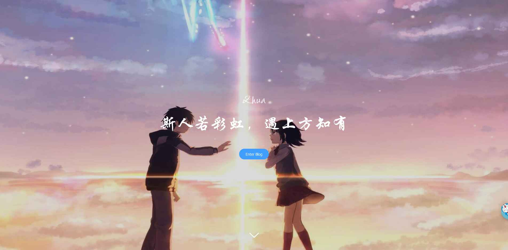

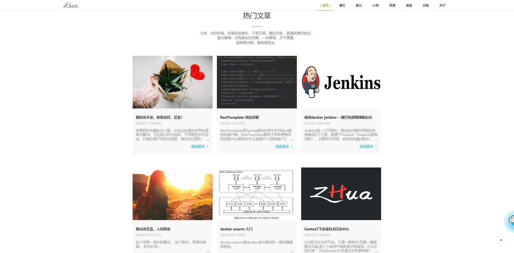

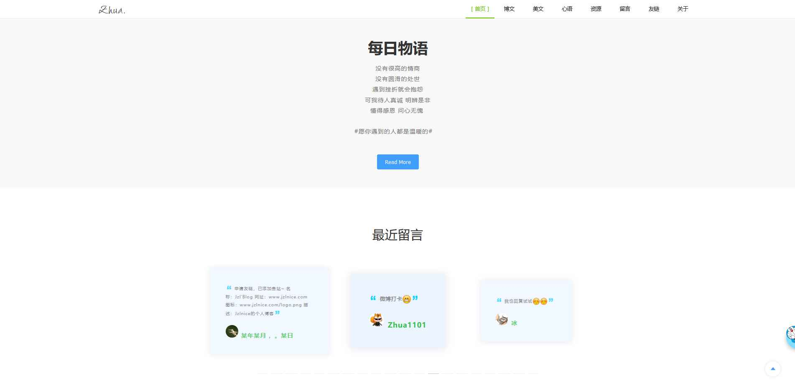

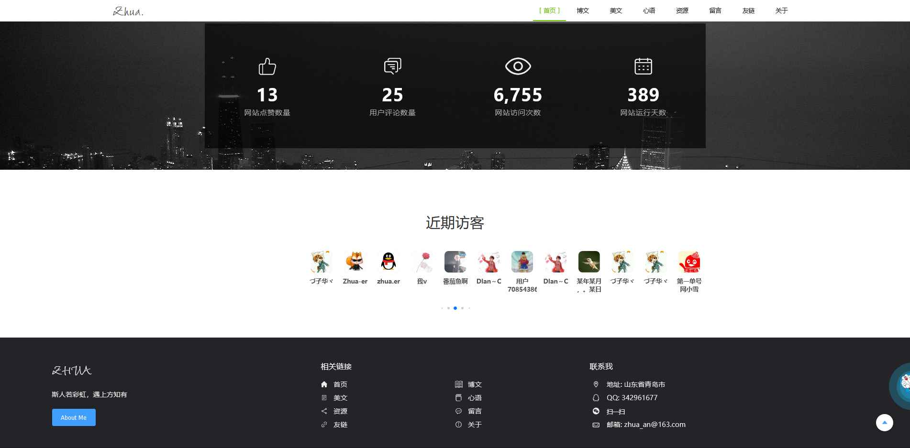

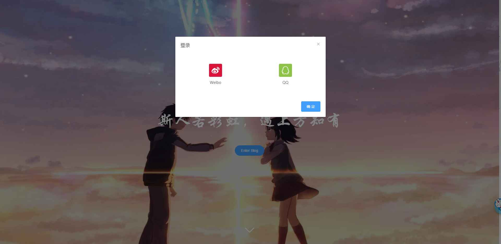

### 博文

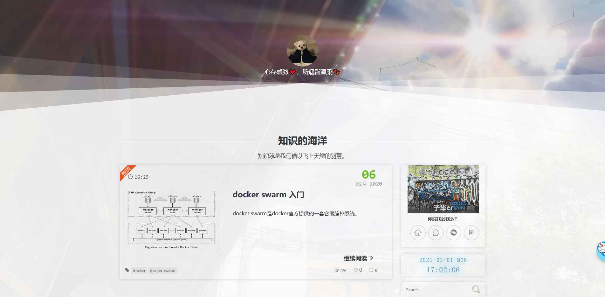

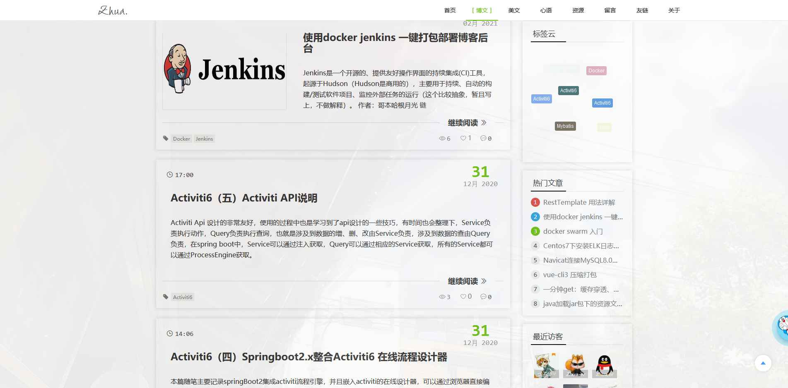

### 美文

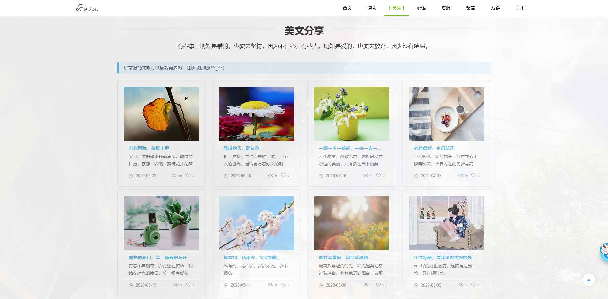

### 心语

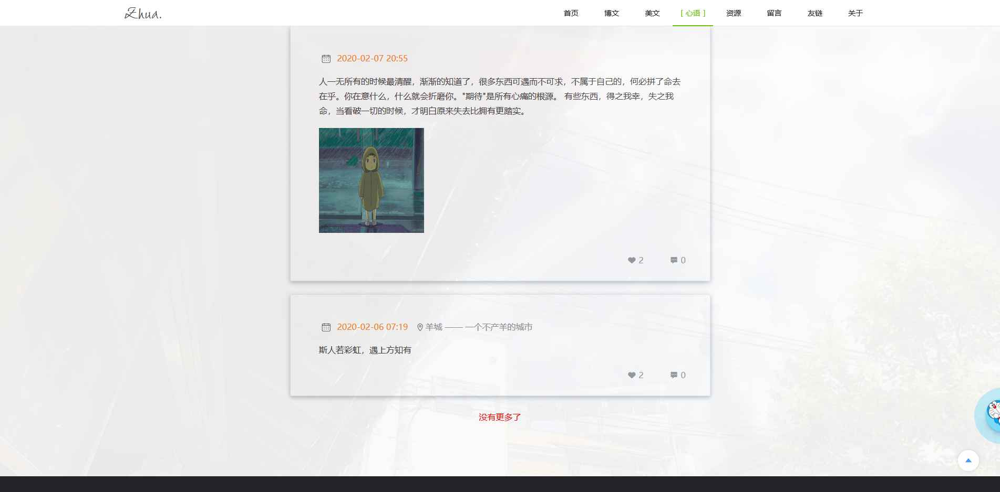

### 资源

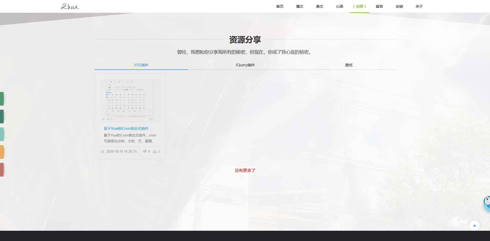

### 留言板

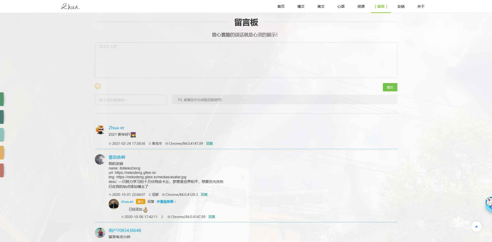

### 友链

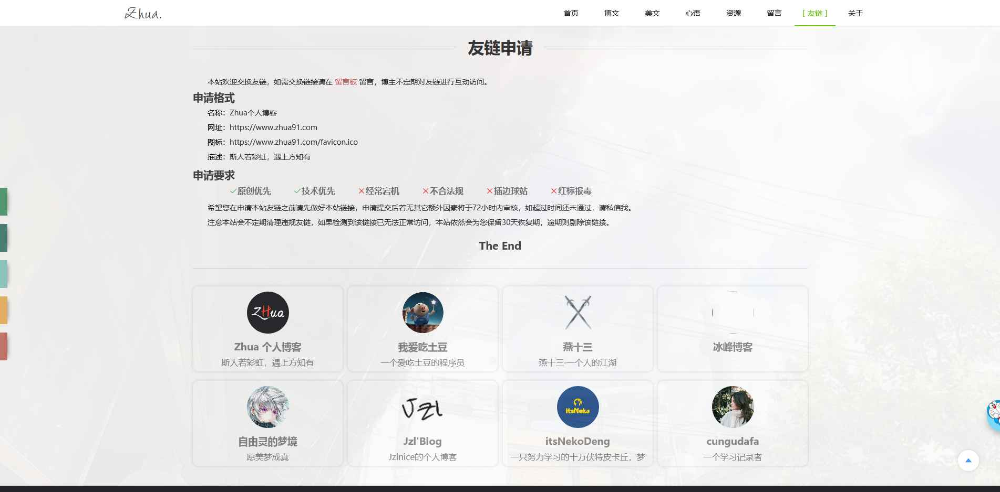

### 关于

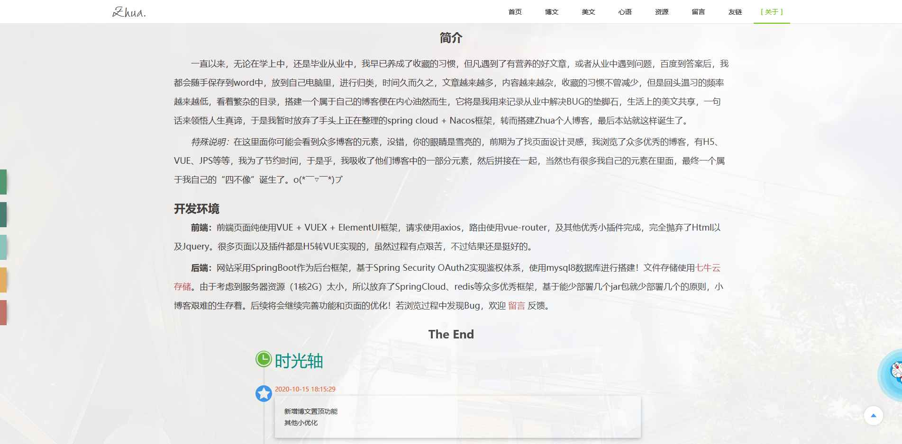

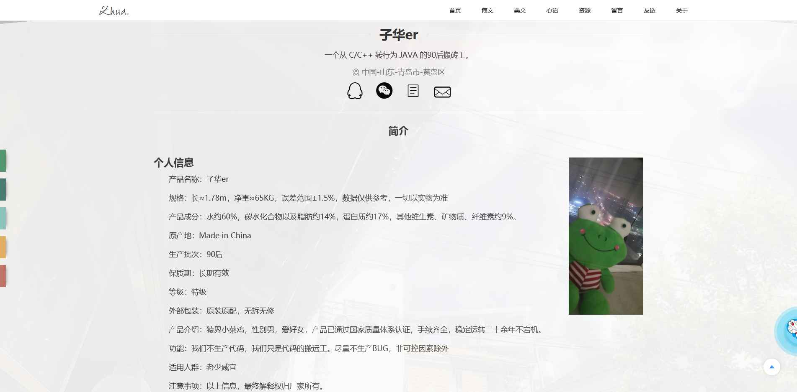


Copyright (c) 2020-present, Zhua
